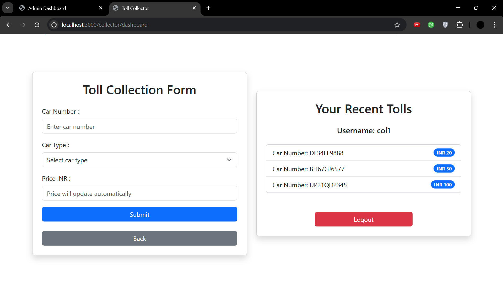
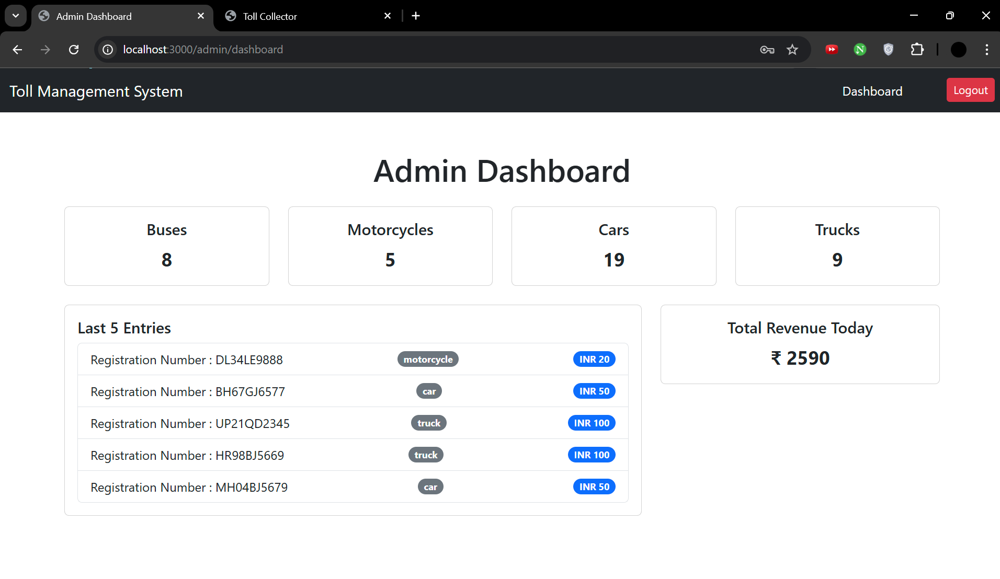

# Toll Management System

A Toll Management System built using the MERN stack with real-time dashboard updates powered by Socket.io.

## Features
- **User Management**: Register and authenticate toll operators.
- **Vehicle Entry & Exit**: Log vehicle details and calculate toll fees dynamically.
- **Real-time Dashboard**: Live toll transactions and status updates using Socket.io.
- **Admin Panel**: Manage toll booths, operators, and transactions.

## Tech Stack
- **Frontend**: React
- **Backend**: Node.js, Express.js
- **Database**: MongoDB with Mongoose
- **Real-time Communication**: Socket.io

## Installation

### Prerequisites
Ensure you have the following installed:
- Node.js (>=14.x)
- MongoDB

### Setup
1. Clone the repository:
   ```bash
   git clone https://https://github.com/aryansharma0305/TollManagementSystem-NodeJS
   cd TollManagementSystem-NodeJS
   ```

2. Install dependencies for both backend and frontend:
   ```bash
   npm install
   ```

3. Create a `.env` file in the `backend` directory and add:
   ```env
   MONGO_URI=your_mongodb_connection_string
   PORT=5000
   JWT_SECRET=your_secret_key
   ```

## Running the Application

1. Start the backend server:
   ```bash
   npm start
   ```


2. Access the application at:
   ```
   http://localhost:3000
   ```

## Real-time Updates with Socket.io
- When a vehicle enters/exits, the dashboard updates instantly.
- Admins can monitor real-time toll collection and booth status.


## Screenshots






